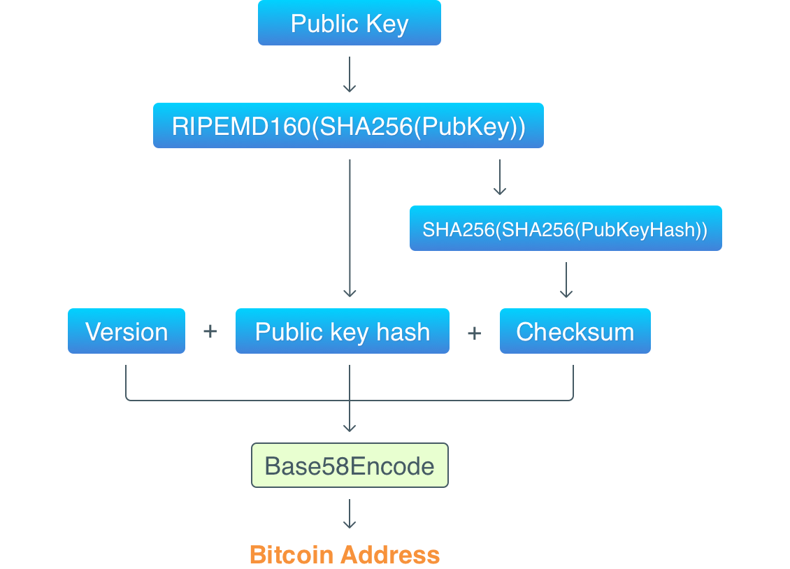

# Go-Burokkuchen

This is a very simple implementation of a blokchain in the go programming language. This project follows a guide from articles created by [Jeiwan](https://github.com/Jeiwan).

---

## Table of Contents

- [Go-Burokkuchen](#go-burokkuchen)
	- [Table of Contents](#table-of-contents)
	- [Chapter 1: Basic Prototype](#chapter-1-basic-prototype)
		- [Block](#block)
		- [Blockchain](#blockchain)
	- [Chapter 2: Proof of Work](#chapter-2-proof-of-work)
		- [Proof of Work](#proof-of-work)
		- [Hashing](#hashing)
		- [Hashcash](#hashcash)
	- [Chapter 3: Persistence and CLI](#chapter-3-persistence-and-cli)
		- [Database Choice](#database-choice)
		- [Database Structure](#database-structure)
	- [Chapter 4: Transactions I](#chapter-4-transactions-i)
		- [Transactions](#transactions)
	- [Chapter 5: Addresses](#chapter-5-addresses)
		- [Bitcoin Address](#bitcoin-address)
		- [Public-Key Cryptography](#public-key-cryptography)
		- [Digital Signatures](#digital-signatures)
		- [Life Cycle of a Transaction](#life-cycle-of-a-transaction)
		- [Elliptic Curve Cryptography](#elliptic-curve-cryptography)
		- [Base58](#base58)

---

## Chapter 1: [Basic Prototype](https://jeiwan.net/posts/building-blockchain-in-go-part-1/)

### Block

Implemented a simplified version of a block with a data structure as follows:

```golang
type Block struct {
	Timestamp     int64
	Data          []byte
	PrevBlockHash []byte
	Hash          []byte
}
```

The fields in the block structure are:

-   `Timestamp` is the current timestamp (when the block is created).
-   `Data` is the valuable information contained in the block.
-   `PrevBlockHash` stores the hash of the previous block.
-   `Hash` is the hash of the block

In Bitcoin specifications `Timestamp`, `PrevBlockHash`, and `Hash` are [**block headers**](https://developer.bitcoin.org/reference/block_chain.html#), which form a separate data structure, and transactions (`Data` in our case) is also a separate data structure.

### Blockchain

In its essence a blockchain is a database with an ordered, back-linked list structure. This means that every blocks are stored in the insertion order and each block is linked to the previous one. The implementation of this structure is as follows:

```golang
type Blockchain struct {
	blocks []*Block
}
```

The blockchain will be used as an array of blocks, with each block having a connection to the previous one. The actual blockchain is much more complex though.

---

## Chapter 2: [Proof of Work](https://jeiwan.net/posts/building-blockchain-in-go-part-2/)

### Proof of Work

A key idea of blockchain is that one has to perform some hard work to put data in it. It is this hard work that makes blockchain secure and consistent. Also, a reward is paid for this hard work (this is how people get coins for mining).

Proof of Work algorithms must meet a requirement: **doing the work is hard**, but **verifying the proof is easy**. A proof is usually handed to someone else, so for them, it shouldn’t take much time to verify it.

### Hashing

Hashing is a process of obtaining a hash for specified data. A hash is a unique representation of the data it was calculated on. A hash function is a function that takes data of arbitrary size and produces a fixed size hash. Here are some key features of hashing:

1. Original data cannot be restored from a hash. Thus, **hashing is not encryption**.
2. Certain data can **have only one hash** and the **hash is unique**.
3. Changing even one byte in the input data will result in a completely different hash.

In blockchain, hashing is used to **guarantee the consistency of a block**. The input data for a hashing algorithm contains the hash of the previous block, thus making it impossible (or, at least, quite difficult) to modify a block in the chain: one has to recalculate its hash and hashes of all the blocks after it.

### Hashcash

Bitcoin uses [_Hashcash_](https://en.wikipedia.org/wiki/Hashcash), a Proof of Work algorithm that was initially developed to prevent email spam. It can be split into the following steps:

1. Take some publicly known data (in case of email, it’s receiver’s email address; in case of Bitcoin, it’s block headers).
2. Add a counter to it. The counter starts at 0.
3. Get a hash of the data + counter combination.
4. Check that the hash meets certain requirements.
    1. If it does, you’re done.
    2. If it doesn’t, increase the counter and repeat the steps 3 and 4.

Thus, this is a brute force algorithm: you change the counter, calculate a new hash, check it, increment the counter, calculate a hash, check it again, and so on. That’s why it’s computationally expensive.

---

## Chapter 3: [Persistence and CLI](https://jeiwan.net/posts/building-blockchain-in-go-part-3/)

### Database Choice

Implementing a database into our blockchain will let use reuse a blockchain and share it with others. Without a database we create a new blockchain everytime we run the program and store them in memory. When the program closes, the blockchain is erased. There are no specific database which must be used for a blockchain so it's up to the developer which database to use.

In this project we will be using [**BoltDB (bbolt)**](https://github.com/etcd-io/bbolt). We are using this specific repository as it is forked from the original [**BoltDB**](https://github.com/boltdb/bolt) repository but with an active maintenance and development target. We are using this specific database because of these reasons:

1. Minimalistic.
2. Implemented in Golang.
3. Doesn't require to run a server.
4. Utilizes **key/value storage system** which allows us to build the data structure we need.

### Database Structure

The database structure used here will refer to the way Bitcoin Core stores its data. Bitcoin Core uses two "_buckets_" to store data:

1. `blocks` stores the metadata describing all the blocks in the chain.
2. `chainstate` stores the state of a chain, which is all current unspent transaction output's metadata.

Blocks are also stored on different files on the disk, this is done for performance optimization where reading a single block won't require loading the whole blocks data into memory. **This will not be implemented here**.

In `blocks`, the `key` -> `value` pairs are as follows:

1. `'b' + 32-byte block hash` -> `block index record`
2. `'f' + 4-byte file number` -> `file information record`
3. `'l'` -> `4-byte file number (the last block file number used)`
4. `'R'` -> `1-byte boolean (whether we're in the process of reindexing)`
5. `'F' + 1-byte flag name length + flag name string` -> `1 byte boolean (various flags that can be on or off)` <br />
6. `'t' + 32-byte transaction hash` -> `transaction index record`

In `chainstate`, the `key` -> `value` pairs are as follows:

1. `'c' + 32-byte transaction hash` -> `unspent transaction output record for that transaction`
2. `'B'` -> `32-byte block hash (the block hash up to which the database represents the unspent transaction outputs)`

Further reading [**Bitcoin Core: Data Storage**](<https://en.bitcoin.it/wiki/Bitcoin_Core_0.11_(ch_2):_Data_Storage>).

Since we haven't implemented transactions, we're going to only have the `blocks` bucket. We will also store all the blocks in one database file, removing the need to store anything related to file numbers. The `key` -> `value` pairs we will be using are:

1. `32-byte block-hash` -> `Block structure (serialized)`
2. `'l'` -> `the hash of the last block in a chain`

---

## Chapter 4: [Transactions I](https://jeiwan.net/posts/building-blockchain-in-go-part-4/)

### Transactions

The purpose of a blockchain is to store transactions in a secure and reliable way, so no one could modify them after they are created and inserted into the blockchain.

This section will implement the general mechanism of transactions, which includes getting the balance of an _address_ and sending tokens to other _addresses_.

Note that the _address_ used here is just an arbitrary string used to represent an _address_. **private-key based addresses** will be implemented in the next section, along with other Bitcoin-like transactional features such as:

-   `Rewards`: **Mining is the process of trying to add a new block of transactions on to the blockchain**, which take huge amounts of computational power, which is why the node mining a block is usually compensated with a reward. Right now our blockchain doesn't give out rewards for mining a block, so it's absolutely not profitable.
-   `Unspent Transaction Outputs Set`: UTXOs are the amount of digital currency that remains after a cryptocurrency transaction. Right now, getting balance requires scanning the whole blockchain, which can take very long time when there are many and many blocks. It will also take a lot of time if we want to validate later transactions. **UTXO set is the comprehensive set of all UTXOs existing at a given point in time**, this will make operations with transactions way faster.
-   `Mempool`: Mempool is a blockchain node's version of a waiting room for **not-yet-approved transactions**. This is where transactions are stored before being packed in a block. In our current implementation, a block contains only one transaction, and this is quite inefficient.

---

## Chapter 5: [Addresses](https://jeiwan.net/posts/building-blockchain-in-go-part-5/)

### Bitcoin Address

Here's an example of a Bitcoin address: `1A1zP1eP5QGefi2DMPTfTL5SLmv7DivfNa`.

Bitcoin addresses are **public**. If you want to send coins to someone, you need to know their address. Bitcoin relies on a combination of cryptography algorithms to create these keys, and guarantee that no one else in the world can access your coins without getting physical access to your keys.

### Public-Key Cryptography

**Public-key cryptography** algorithms use pairs of keys: `public keys` and `private keys`. **Public keys are not sensitive** and can be disclosed to anyone. In contrast, **private keys shouldn’t be disclosed**: no one but the owner should have access to them because it’s private keys that serve as the identifier of the owner.

In essence, a Bitcoin wallet is just a pair of such keys. When you install a wallet application or use a Bitcoin client to generate a new address, a pair of keys is generated for you. The one who controls the private key controls all the coins sent to this key in Bitcoin.

> If you’ve ever used a Bitcoin wallet application, it’s likely that a mnemonic pass phrase was generated for you. Such phrases are used instead of private keys and can be used to generate them. This mechanism is implemented in [BIP-039](https://github.com/bitcoin/bips/blob/master/bip-0039.mediawiki).

### Digital Signatures

In mathematics and cryptography, there’s a concept of digital signature – algorithms that guarantee:

1. That data wasn’t modified while being transferred from a sender to a recipient.
2. That data was created by a certain sender.
3. That the sender cannot deny sending the data.

By applying a signing algorithm to data (i.e., signing the data), one gets a signature, which can later be verified. Digital signing happens with the usage of a private key, and verification requires a public key.

In order to sign data we need the following things:

1. Data to sign.
2. Private key.

The operation of signing produces a signature, which is stored in transaction inputs. In order to verify a signature, the following is required:

1. Data that was signed.
2. The signature.
3. Public key.
   In simple terms, the verification process can be described as: check that this signature was obtained from this data with a private key used to generate the public key.

Every transaction input in Bitcoin is signed by the one who created the transaction. Every transaction in Bitcoin must be verified before being put in a block. Verification means (besides other procedures):

1. Checking that inputs have permission to use outputs from previous transactions.
2. Checking that the transaction signature is correct.

### Life Cycle of a Transaction

1. In the beginning, there’s the genesis block that contains a coinbase transaction. There are no real inputs in coinbase transactions, so signing is not necessary. The output of the coinbase transaction contains a hashed public key `(RIPEMD16(SHA256(PubKey))`.
2. When one sends coins, a transaction is created. Inputs of the transaction will reference outputs from previous transaction(s). Every input will store a public key (not hashed) and a signature of the whole transaction.
3. Other nodes in the Bitcoin network that receive the transaction will verify it. Besides other things, they will check that: the hash of the public key in an input matches the hash of the referenced output (this ensures that the sender spends only coins belonging to them); the signature is correct (this ensures that the transaction is created by the real owner of the coins).
4. When a miner node is ready to mine a new block, it’ll put the transaction in a block and start mining it.
5. When the blocked is mined, every other node in the network receives a message saying the block is mined and adds the block to the blockchain.
6. After a block is added to the blockchain, the transaction is completed, its outputs can be referenced in new transactions.

### Elliptic Curve Cryptography

The randomness algorithm used for generating private keys must produce truly random bytes. We don’t want to accidentally generate a private key that’s owned by someone else.

Bitcoin uses [**elliptic curves**](http://andrea.corbellini.name/2015/05/17/elliptic-curve-cryptography-a-gentle-introduction/) to generate private keys. These curves can be used to generate really big and random numbers. The curve used by Bitcoin can randomly pick a number between `0` and `2²⁵⁶` (which is approximately `10⁷⁷`, when there are between 10⁷⁸ and 10⁸² atoms in the visible universe). Such a huge upper limit means that it’s almost impossible to generate the same private key twice.

Also, Bitcoin uses ECDSA (Elliptic Curve Digital Signature Algorithm) algorithm to sign transactions.

### Base58

Now let’s get back to the above mentioned Bitcoin address: `1A1zP1eP5QGefi2DMPTfTL5SLmv7DivfNa`.

Now we know that this is a human-readable representation of a public key. And if we decode it, here’s what the public key looks like (as a sequence of bytes written in the hexadecimal system): `0062E907B15CBF27D5425399EBF6F0FB50EBB88F18C29B7D93`

Bitcoin uses the **Base58** algorithm to convert public keys into human readable format. The algorithm is very similar to famous Base64, but it uses shorter alphabet: some letters were removed from the alphabet to avoid some attacks that use letters similarity. Thus, there are no these symbols: `0` (zero), `O` (capital o), `I` (capital i), `l` (lowercase L), because they look similar. Also, there are no `+` and `/` symbols.

Let’s schematically visualize the process of getting an address from a public key:



Thus, the above mentioned decoded public key consists of three parts:

``` markdown
Version  	Public key hash                           										Checksum
00       		62E907B15CBF27D5425399EBF6F0FB50EBB88F18  	C29B7D93
```

Since hashing functions are **one way** (they cannot be reversed), it’s not possible to extract the public key from the hash. But we can check if a public key was used to get the hash by running it through the same hash functions and comparing the hashes.

---
